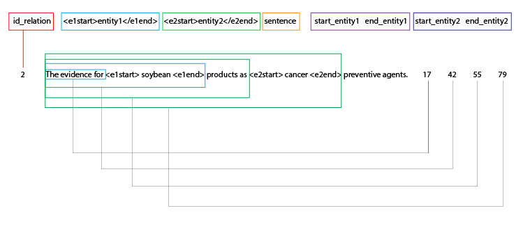
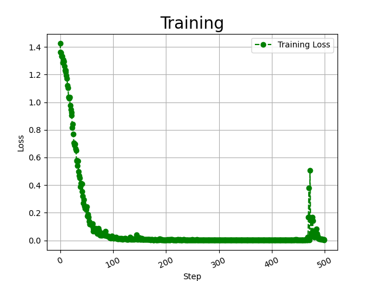
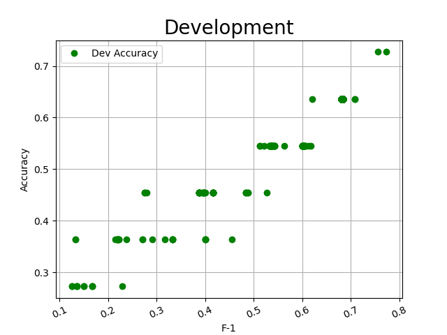

#  **NLP Research**
# **Relation Extraction in Biomedical using Bert-LSTM-CRF model and pytorch**
##  **`Dimas Dwi Putra`**
 NLP Research - Bert Relation Extraction in Biomedical.

[Notebook 1.ipynb](BiomedNLP_PubMedBERT_Notebook.ipynb)<br>
[Notebook 2.ipynb](Biobert_Notebook.ipynb)

#  Config
```yaml
#!/usr/bin/env bash
python "main.py" \
--bert_dir="model/BiomedNLP-PubMedBERT/" \
--data_dir="input/data/" \
--log_dir="output/logs/" \
--output_dir="output/checkpoint/" \
--num_tags=4 \
--seed=123 \
--gpu_ids="0" \
--max_seq_len=128 \
--lr=1e-5 \
--other_lr=1e-4 \
--train_batch_size=64 \
--train_epochs=500 \
--eval_batch_size=64 \
--dropout_prob=0.1 \
```

#  Dataset
 [View Directory](input/data/)


Dictionary
```json
{"Cause_of_disease": 0, "Treatment_of_disease": 1, "Negative": 2, "Association": 3}
```
Data Preprocessing



Example
```yaml
id_relation	<e1start>entity1</e1end>	<e2start>entity2</e2end>	sentence	start_entity1	end_entity1	start_entity2	end_entity2
```
- Training Set
```yaml
2	The evidence for <e1start> soybean <e1end> products as <e2start> cancer <e2end> preventive agents.  	17	42	55	79
1	[Mortality trends in <e2start> cancer <e2end> attributable to <e1start> tobacco <e1end> in Mexico].  	62	87	21	45
3	<e1start> Areca <e1end> nut chewing has a significant association with <e2start> systemic inflammation <e2end>.	0	23	71	110
```
- Testing Set
```yaml
1	Its effect on <e1start> digitalis <e1end>-caused <e2start> atrial arrhythmias <e2end> is unknown. 	14	41	49	85
0	However, the growth rate of <e2start> tumors <e2end> was not markedly inhibited by <e1start> garlic <e1end>. 	83	107	28	52
1	<e1start> Tobacco <e1end>-related <e2start> cancers <e2end> in Madras, India.  	0	25	34	59
```

#  Model input
 [View Directory](model/)

`git clone https://huggingface.co/microsoft/BiomedNLP-PubMedBERT-base-uncased-abstract-fulltext`

```yaml
config.json
flax_model.msgpack
pytorch_model.bin
special_tokens_map.json
tokenizer_config.json
vocab.txt
```
config.json

```json
{
  "architectures": [
      "BertForMaskedLM"
   ],
   "model_type": "bert",
   "attention_probs_dropout_prob": 0.1,
   "hidden_act": "gelu",
   "hidden_dropout_prob": 0.1,
   "hidden_size": 768,
   "initializer_range": 0.02,
   "intermediate_size": 3072,
   "max_position_embeddings": 512,
   "num_attention_heads": 12,
   "num_hidden_layers": 12,
   "type_vocab_size": 2,
   "vocab_size": 30522
}
```


##  Preprocessing
```yaml
2022-06-04 22:02:26,739 - INFO - preprocess.py - <module> - 180 - {'output_dir': 'output/checkpoint/', 'bert_dir': 'model/BiomedNLP-PubMedBERT/', 'data_dir': 'input/data/', 'log_dir': 'output/logs/', 'num_tags': 4, 'seed': 123, 'gpu_ids': '0', 'max_seq_len': 128, 'eval_batch_size': 64, 'swa_start': 3, 'train_epochs': 10, 'dropout_prob': 0.8, 'lr': 1e-05, 'other_lr': 0.0001, 'max_grad_norm': 1, 'warmup_proportion': 0.1, 'weight_decay': 0.01, 'adam_epsilon': 1e-12, 'train_batch_size': 64, 'eval_model': True}
2022-06-04 22:02:26,742 - INFO - preprocess.py - get_out - 151 - ==========================
2022-06-04 22:02:26,742 - INFO - preprocess.py - get_out - 152 - example_text : Halothane is known to oppose <e1start> digitalis <e1end>-induced <e2start> ventricular arrhythmias <e2end>. 
2022-06-04 22:02:26,742 - INFO - preprocess.py - get_out - 153 - example_id_label : 0
2022-06-04 22:02:26,742 - INFO - preprocess.py - get_out - 154 - example_id_tags : [29, 56, 65, 106]
2022-06-04 22:02:26,743 - INFO - preprocess.py - get_out - 155 - ==========================
2022-06-04 22:02:27,162 - INFO - preprocess.py - convert_examples_to_features - 120 - Convert 46 examples to features
2022-06-04 22:02:27,163 - INFO - preprocess.py - convert_bert_example - 95 - *** train_example-0 ***
2022-06-04 22:02:27,163 - INFO - preprocess.py - convert_bert_example - 96 - text: [CLS] [UNK] a l o t h a n e [UNK] i s [UNK] k n o w n [UNK] t o [UNK] o p p o s e [UNK] < e 1 s t a r t > [UNK] d i g i t a l i s [UNK] < e 1 e n d > - i n d u c e d [UNK] < e 2 s t a r t > [UNK] v e n t r i c u l a r [UNK] a r r h y t h m i a s [UNK] < e 2 e n d >. [UNK] [SEP]
2022-06-04 22:02:27,163 - INFO - preprocess.py - convert_bert_example - 97 - token_ids: [2, 1, 43, 54, 57, 62, 50, 43, 56, 47, 1, 51, 61, 1, 53, 56, 57, 65, 56, 1, 62, 57, 1, 57, 58, 58, 57, 61, 47, 1, 32, 47, 21, 61, 62, 43, 60, 62, 34, 1, 46, 51, 49, 51, 62, 43, 54, 51, 61, 1, 32, 47, 21, 47, 56, 46, 34, 17, 51, 56, 46, 63, 45, 47, 46, 1, 32, 47, 22, 61, 62, 43, 60, 62, 34, 1, 64, 47, 56, 62, 60, 51, 45, 63, 54, 43, 60, 1, 43, 60, 60, 50, 67, 62, 50, 55, 51, 43, 61, 1, 32, 47, 22, 47, 56, 46, 34, 18, 1, 3, 0, 0, 0, 0, 0, 0, 0, 0, 0, 0, 0, 0, 0, 0, 0, 0, 0, 0]
2022-06-04 22:02:27,163 - INFO - preprocess.py - convert_bert_example - 98 - attention_masks: [1, 1, 1, 1, 1, 1, 1, 1, 1, 1, 1, 1, 1, 1, 1, 1, 1, 1, 1, 1, 1, 1, 1, 1, 1, 1, 1, 1, 1, 1, 1, 1, 1, 1, 1, 1, 1, 1, 1, 1, 1, 1, 1, 1, 1, 1, 1, 1, 1, 1, 1, 1, 1, 1, 1, 1, 1, 1, 1, 1, 1, 1, 1, 1, 1, 1, 1, 1, 1, 1, 1, 1, 1, 1, 1, 1, 1, 1, 1, 1, 1, 1, 1, 1, 1, 1, 1, 1, 1, 1, 1, 1, 1, 1, 1, 1, 1, 1, 1, 1, 1, 1, 1, 1, 1, 1, 1, 1, 1, 1, 0, 0, 0, 0, 0, 0, 0, 0, 0, 0, 0, 0, 0, 0, 0, 0, 0, 0]
2022-06-04 22:02:27,163 - INFO - preprocess.py - convert_bert_example - 99 - token_type_ids: [0, 0, 0, 0, 0, 0, 0, 0, 0, 0, 0, 0, 0, 0, 0, 0, 0, 0, 0, 0, 0, 0, 0, 0, 0, 0, 0, 0, 0, 0, 0, 0, 0, 0, 0, 0, 0, 0, 0, 0, 0, 0, 0, 0, 0, 0, 0, 0, 0, 0, 0, 0, 0, 0, 0, 0, 0, 0, 0, 0, 0, 0, 0, 0, 0, 0, 0, 0, 0, 0, 0, 0, 0, 0, 0, 0, 0, 0, 0, 0, 0, 0, 0, 0, 0, 0, 0, 0, 0, 0, 0, 0, 0, 0, 0, 0, 0, 0, 0, 0, 0, 0, 0, 0, 0, 0, 0, 0, 0, 0, 0, 0, 0, 0, 0, 0, 0, 0, 0, 0, 0, 0, 0, 0, 0, 0, 0, 0]
2022-06-04 22:02:27,164 - INFO - preprocess.py - convert_bert_example - 100 - labels: 0
2022-06-04 22:02:27,164 - INFO - preprocess.py - convert_bert_example - 101 - ids: [30, 57, 66, 107]
. . . 
```
[LOAD MORE..](output/logs)

#  Output



[LOAD MORE.. ](output/Visualization)

- Train
```yaml
2022-06-06 17:47:43,346 - INFO - main.py - train - 86 - 【train】 epoch：488 step:488/500 loss：0.016277
2022-06-06 17:47:43,547 - INFO - main.py - train - 92 - 【dev】 loss：1.819899 accuracy：0.7273 micro_f1：0.7273 macro_f1：0.7738
2022-06-06 17:47:43,547 - INFO - main.py - train - 94 - ------------>Save best model
...
```
- Test
```yaml
2022-06-06 17:48:03,406 - INFO - main.py - <module> - 247 - ======== Calculate Testing========
2022-06-06 17:48:06,156 - INFO - main.py - <module> - 251 - 【test】 loss：1.819899 accuracy：0.7273 micro_f1：0.7273 macro_f1：0.7738
...
2022-06-06 17:48:06,159 - INFO - main.py - <module> - 253 -
```
```
                       precision    recall  per-class    support
                                            f1-scores

    Cause_of_disease       1.00      0.75      0.86         4
Treatment_of_disease       0.50      0.67      0.57         3
            Negative       0.67      0.67      0.67         3
         Association       1.00      1.00      1.00         1
```

```
                         precision    recall   Average     support
                                              f1-scores

            accuracy                            0.73         11
           macro avg       0.79        0.77     0.77         11
        weighted avg       0.77        0.73     0.74         11
```
[LOAD MORE.. ](output/logs)

- Predict
```yaml
2022-06-06 17:48:21,778 - INFO - predict.py - <module> - 208 - {'Cause_of_disease': 0, 'Treatment_of_disease': 1, 'Negative': 2, 'Association': 3}
2022-06-06 17:48:21,912 - INFO - predict.py - <module> - 240 - ======== Prediction ========
2022-06-06 17:48:30,387 - INFO - predict.py - <module> - 252 - Halothane is known to oppose <e1start> digitalis <e1end>-induced <e2start> ventricular arrhythmias <e2end>. 
2022-06-06 17:48:32,477 - INFO - predict.py - <module> - 254 - predict labels：Cause_of_disease
2022-06-06 17:48:32,477 - INFO - predict.py - <module> - 255 - true label：Cause_of_disease
2022-06-06 17:48:32,477 - INFO - predict.py - <module> - 256 - ==========================
2022-06-06 17:48:32,477 - INFO - predict.py - <module> - 252 - Both cases proved to be <e1start> cotton <e1end>-material-induced <e2start> granulomas <e2end>. 
2022-06-06 17:48:34,386 - INFO - predict.py - <module> - 254 - predict labels：Cause_of_disease
2022-06-06 17:48:34,386 - INFO - predict.py - <module> - 255 - true label：Cause_of_disease
2022-06-06 17:48:34,386 - INFO - predict.py - <module> - 256 - ==========================
2022-06-06 17:48:34,386 - INFO - predict.py - <module> - 252 - The evidence for <e1start> soybean <e1end> products as <e2start> cancer <e2end> preventive agents.  
2022-06-06 17:48:36,268 - INFO - predict.py - <module> - 254 - predict labels：Cause_of_disease
2022-06-06 17:48:36,268 - INFO - predict.py - <module> - 255 - true label：Treatment_of_disease
2022-06-06 17:48:36,268 - INFO - predict.py - <module> - 256 - ==========================
2022-06-06 17:48:36,268 - INFO - predict.py - <module> - 252 - [Mortality trends in <e2start> cancer <e2end> attributable to <e1start> tobacco <e1end> in Mexico].  
2022-06-06 17:48:38,163 - INFO - predict.py - <module> - 254 - predict labels：Cause_of_disease
2022-06-06 17:48:38,164 - INFO - predict.py - <module> - 255 - true label：Cause_of_disease
2022-06-06 17:48:38,164 - INFO - predict.py - <module> - 256 - ==========================
2022-06-06 17:48:38,164 - INFO - predict.py - <module> - 252 - <e1start> Areca <e1end> nut chewing has a significant association with <e2start> systemic inflammation <e2end>.
2022-06-06 17:48:40,109 - INFO - predict.py - <module> - 254 - predict labels：Association
2022-06-06 17:48:40,109 - INFO - predict.py - <module> - 255 - true label：Association
2022-06-06 17:48:40,109 - INFO - predict.py - <module> - 256 - ==========================
...
```
[LOAD MORE.. ](output/logs)

#  Model output
 [view model](https://drive.google.com/drive/folders/1_xUN_FlX9-4kt_CYCnf-gHwJh7G6k6qg?usp=sharing)

`Best.pt`
model created by pytorch after Train and Validation 
