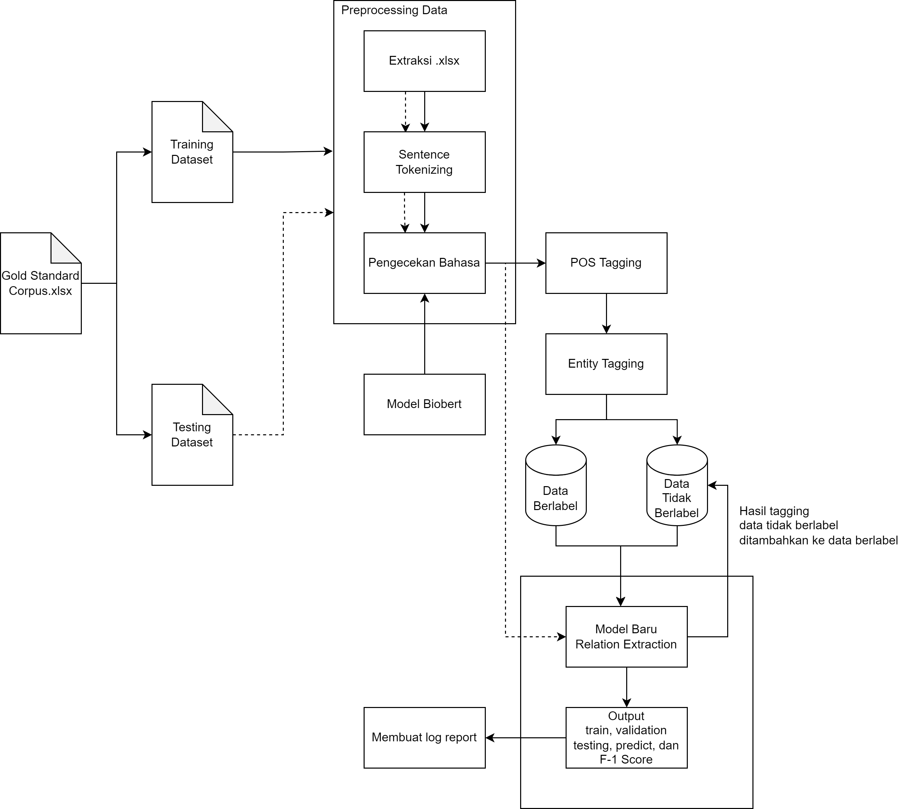

# NLP - Relation Extraction Biobert
NLP Research - Bert Relation Extraction in Biomedical.
<!-- 

-->
# Config
```yaml
#!/usr/bin/env bash
python main.py \
--bert_dir="model/biobert/" \
--data_dir="input/data/" \
--log_dir="output/logs/" \
--output_dir="output/checkpoint/" \
--num_tags=4 \
--seed=123 \
--gpu_ids="-1" \
--max_seq_len=128 \
--lr=3e-5 \
--other_lr=3e-4 \
--train_batch_size=32 \
--train_epochs=100 \
--eval_batch_size=32 \
--dropout_prob=0.3 \
```

# Dataset
[View Directory](input/data/)


Dictionary
```json
{"Negative": 0, "Cause_of_disease": 1, "Treatment_of_disease": 2, "Association": 3}
```
Data Preprocessing


example
```yaml
id_relation	<e1start>entity1</e1end>	<e2start>entity2</e2end>	sentence	start_entity1	end_entity1	start_entity2	end_entity2
```
- Training Set
```yaml
2	The evidence for <e1start> soybean <e1end> products as <e2start> cancer <e2end> preventive agents.  	17	42	55	79
1	[Mortality trends in <e2start> cancer <e2end> attributable to <e1start> tobacco <e1end> in Mexico].  	62	87	21	45
3	<e1start> Areca <e1end> nut chewing has a significant association with <e2start> systemic inflammation <e2end>.	0	23	71	110
```
- Testing Set
```yaml
1	Its effect on <e1start> digitalis <e1end>-caused <e2start> atrial arrhythmias <e2end> is unknown. 	14	41	49	85
0	However, the growth rate of <e2start> tumors <e2end> was not markedly inhibited by <e1start> garlic <e1end>. 	83	107	28	52
1	<e1start> Tobacco <e1end>-related <e2start> cancers <e2end> in Madras, India.  	0	25	34	59
```

# Model input
Biobert<br>[View Directory](model/)
```yaml
config.json
flax_model.msgpack
pytorch_model.bin
special_tokens_map.json
tokenizer_config.json
vocab.txt
```

## Preprocessing
```yaml
2022-06-01 20:53:23,906 - INFO - preprocess.py - <module> - 185 - {'output_dir': 'input/checkpoint/', 'bert_dir': 'model/biobert/', 'data_dir': 'input/data/', 'log_dir': 'output/logs/', 'num_tags': 4, 'seed': 123, 'gpu_ids': '-1', 'max_seq_len': 128, 'eval_batch_size': 32, 'swa_start': 3, 'train_epochs': 100, 'dropout_prob': 0.3, 'lr': 3e-05, 'other_lr': 0.0003, 'max_grad_norm': 1, 'warmup_proportion': 0.1, 'weight_decay': 0.01, 'adam_epsilon': 1e-08, 'train_batch_size': 32, 'eval_model': True}
2022-06-01 20:53:23,953 - INFO - preprocess.py - get_out - 156 - ==========================
2022-06-01 20:53:23,953 - INFO - preprocess.py - get_out - 157 - example_text : Halothane is known to oppose <e1start> digitalis <e1end>-induced <e2start> ventricular arrhythmias <e2end>. 
2022-06-01 20:53:23,953 - INFO - preprocess.py - get_out - 158 - example_id_label : 1
2022-06-01 20:53:23,953 - INFO - preprocess.py - get_out - 159 - example_id_tags : [29, 56, 65, 106]
2022-06-01 20:53:23,953 - INFO - preprocess.py - get_out - 160 - ==========================
2022-06-01 20:53:24,062 - INFO - preprocess.py - convert_examples_to_features - 120 - Convert 46 examples to features
2022-06-01 20:53:24,062 - INFO - preprocess.py - convert_bert_example - 95 - *** train_example-0 ***
2022-06-01 20:53:24,062 - INFO - preprocess.py - convert_bert_example - 96 - text: [CLS] H a l o t h a n e [UNK] i s [UNK] k n o w n [UNK] t o [UNK] o p p o s e [UNK] < e 1 s t a r t > [UNK] d i g i t a l i s [UNK] < e 1 e n d > - i n d u c e d [UNK] < e 2 s t a r t > [UNK] v e n t r i c u l a r [UNK] a r r h y t h m i a s [UNK] < e 2 e n d >. [UNK] [SEP]
2022-06-01 20:53:24,062 - INFO - preprocess.py - convert_bert_example - 97 - token_ids: [101, 145, 170, 181, 184, 189, 177, 170, 183, 174, 100, 178, 188, 100, 180, 183, 184, 192, 183, 100, 189, 184, 100, 184, 185, 185, 184, 188, 174, 100, 133, 174, 122, 188, 189, 170, 187, 189, 135, 100, 173, 178, 176, 178, 189, 170, 181, 178, 188, 100, 133, 174, 122, 174, 183, 173, 135, 118, 178, 183, 173, 190, 172, 174, 173, 100, 133, 174, 123, 188, 189, 170, 187, 189, 135, 100, 191, 174, 183, 189, 187, 178, 172, 190, 181, 170, 187, 100, 170, 187, 187, 177, 194, 189, 177, 182, 178, 170, 188, 100, 133, 174, 123, 174, 183, 173, 135, 119, 100, 102, 0, 0, 0, 0, 0, 0, 0, 0, 0, 0, 0, 0, 0, 0, 0, 0, 0, 0]
2022-06-01 20:53:24,062 - INFO - preprocess.py - convert_bert_example - 98 - attention_masks: [1, 1, 1, 1, 1, 1, 1, 1, 1, 1, 1, 1, 1, 1, 1, 1, 1, 1, 1, 1, 1, 1, 1, 1, 1, 1, 1, 1, 1, 1, 1, 1, 1, 1, 1, 1, 1, 1, 1, 1, 1, 1, 1, 1, 1, 1, 1, 1, 1, 1, 1, 1, 1, 1, 1, 1, 1, 1, 1, 1, 1, 1, 1, 1, 1, 1, 1, 1, 1, 1, 1, 1, 1, 1, 1, 1, 1, 1, 1, 1, 1, 1, 1, 1, 1, 1, 1, 1, 1, 1, 1, 1, 1, 1, 1, 1, 1, 1, 1, 1, 1, 1, 1, 1, 1, 1, 1, 1, 1, 1, 0, 0, 0, 0, 0, 0, 0, 0, 0, 0, 0, 0, 0, 0, 0, 0, 0, 0]
2022-06-01 20:53:24,062 - INFO - preprocess.py - convert_bert_example - 99 - token_type_ids: [0, 0, 0, 0, 0, 0, 0, 0, 0, 0, 0, 0, 0, 0, 0, 0, 0, 0, 0, 0, 0, 0, 0, 0, 0, 0, 0, 0, 0, 0, 0, 0, 0, 0, 0, 0, 0, 0, 0, 0, 0, 0, 0, 0, 0, 0, 0, 0, 0, 0, 0, 0, 0, 0, 0, 0, 0, 0, 0, 0, 0, 0, 0, 0, 0, 0, 0, 0, 0, 0, 0, 0, 0, 0, 0, 0, 0, 0, 0, 0, 0, 0, 0, 0, 0, 0, 0, 0, 0, 0, 0, 0, 0, 0, 0, 0, 0, 0, 0, 0, 0, 0, 0, 0, 0, 0, 0, 0, 0, 0, 0, 0, 0, 0, 0, 0, 0, 0, 0, 0, 0, 0, 0, 0, 0, 0, 0, 0]
2022-06-01 20:53:24,062 - INFO - preprocess.py - convert_bert_example - 100 - labels: 1
2022-06-01 20:53:24,062 - INFO - preprocess.py - convert_bert_example - 101 - ids：[30, 57, 66, 107]
. . . 
```

# Output


- Train
```yaml
2022-06-01 22:46:09,282 - INFO - main.py - train - 87 - 【train】 epoch：49 step:99/200 loss：0.005021
2022-06-01 22:47:01,244 - INFO - main.py - train - 93 - 【dev】 loss：2.787870 accuracy：0.3636 micro_f1：0.3636 macro_f1：0.4325
2022-06-01 22:47:01,276 - INFO - main.py - train - 96 - ------------>Save best model
...
```
- Test
```yaml
2022-06-02 00:44:01,213 - INFO - main.py - <module> - 253 - ======== Carry Out Testing========
2022-06-02 00:45:17,446 - INFO - main.py - <module> - 257 - 【test】 loss：2.787870 accuracy：0.3636 micro_f1：0.3636 macro_f1：0.4325
2022-06-02 00:45:17,775 - INFO - main.py - <module> - 259 -
                        precision    recall  f1-score   support

            Negative       0.00      0.00      0.00         3
    Cause_of_disease       0.40      0.50      0.44         4
Treatment_of_disease       0.25      0.33      0.29         3
         Association       1.00      1.00      1.00         1

            accuracy                           0.36        11
           macro avg       0.41      0.46      0.43        11
        weighted avg       0.30      0.36      0.33        11
...
```
- Predict
```yaml
2022-06-02 00:45:17,853 - INFO - main.py - <module> - 263 - ======== Prediction ========
2022-06-02 00:45:33,249 - INFO - main.py - <module> - 275 - Halothane is known to oppose <e1start> digitalis <e1end>-induced <e2start> ventricular arrhythmias <e2end>. 
2022-06-02 00:45:35,858 - INFO - main.py - <module> - 277 - predict labels：Association
2022-06-02 00:45:35,874 - INFO - main.py - <module> - 278 - true label：Cause_of_disease
2022-06-02 00:45:35,874 - INFO - main.py - <module> - 279 - ==========================
2022-06-02 00:45:35,874 - INFO - main.py - <module> - 275 - Both cases proved to be <e1start> cotton <e1end>-material-induced <e2start> granulomas <e2end>. 
2022-06-02 00:45:38,171 - INFO - main.py - <module> - 277 - predict labels：Cause_of_disease
2022-06-02 00:45:38,171 - INFO - main.py - <module> - 278 - true label：Cause_of_disease
2022-06-02 00:45:38,186 - INFO - main.py - <module> - 279 - ==========================
2022-06-02 00:45:38,186 - INFO - main.py - <module> - 275 - The evidence for <e1start> soybean <e1end> products as <e2start> cancer <e2end> preventive agents.  
2022-06-02 00:45:40,342 - INFO - main.py - <module> - 277 - predict labels：Cause_of_disease
2022-06-02 00:45:40,342 - INFO - main.py - <module> - 278 - true label：Treatment_of_disease
2022-06-02 00:45:40,342 - INFO - main.py - <module> - 279 - ==========================
2022-06-02 00:45:40,342 - INFO - main.py - <module> - 275 - [Mortality trends in <e2start> cancer <e2end> attributable to <e1start> tobacco <e1end> in Mexico].  
2022-06-02 00:45:42,749 - INFO - main.py - <module> - 277 - predict labels：Association
2022-06-02 00:45:42,749 - INFO - main.py - <module> - 278 - true label：Cause_of_disease
2022-06-02 00:45:42,749 - INFO - main.py - <module> - 279 - ==========================
2022-06-02 00:45:42,749 - INFO - main.py - <module> - 275 - <e1start> Areca <e1end> nut chewing has a significant association with <e2start> systemic inflammation <e2end>.
2022-06-02 00:45:45,038 - INFO - main.py - <module> - 277 - predict labels：Cause_of_disease
2022-06-02 00:45:45,038 - INFO - main.py - <module> - 278 - true label：Association
2022-06-02 00:45:45,038 - INFO - main.py - <module> - 279 - ==========================
2022-06-02 00:45:45,054 - INFO - main.py - <module> - 275 - <e2start> major depression <e2end> (MD) and regular <e1start> tobacco <e1end> use (RU) or nicotine dependence (ND).
2022-06-02 00:45:47,225 - INFO - main.py - <module> - 277 - predict labels：Association
2022-06-02 00:45:47,225 - INFO - main.py - <module> - 278 - true label：Association
2022-06-02 00:45:47,225 - INFO - main.py - <module> - 279 - ==========================
```

# Model output
[view model](https://drive.google.com/drive/folders/1puazcgbXzkk0o4zUPjbFhUSHsHWL4jhT?usp=sharing)

`Best.pt`
model created by pytorch
