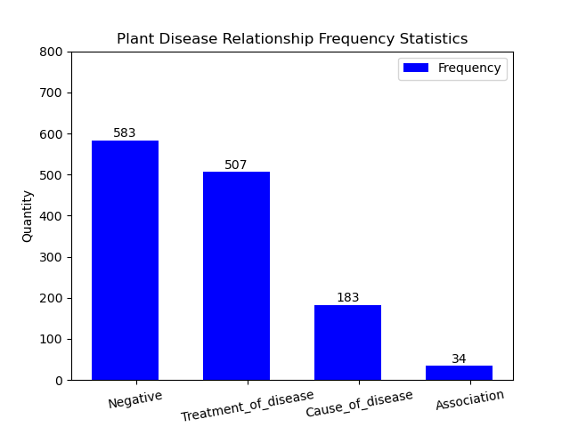
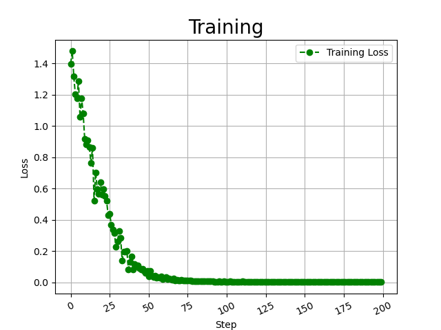

# NLP - Relation Extraction Biobert
NLP Research - Bert Relation Extraction in Biomedical.

# Config
```yaml
#!/usr/bin/env bash
python main.py \
--bert_dir="model/biobert/" \
--data_dir="input/data/" \
--log_dir="output/logs/" \
--output_dir="output/checkpoint/" \
--num_tags=4 \
--seed=123 \
--gpu_ids="-1" \
--max_seq_len=128 \
--lr=3e-5 \
--other_lr=3e-4 \
--train_batch_size=32 \
--train_epochs=100 \
--eval_batch_size=32 \
--dropout_prob=0.3 \
```

# Dataset
[View Directory](input/data/)



Dictionary
```json
{"Negative": 0, "Cause_of_disease": 1, "Treatment_of_disease": 2, "Association": 3}
```
Data Preprocessing
example
```yaml
id_relation	<e1start>entity1</e1end>	<e2start>entity2</e2end>	sentence	start_entity1	end_entity1	start_entity2	end_entity2
```
- Training Set
```yaml
2	The evidence for <e1start> soybean <e1end> products as <e2start> cancer <e2end> preventive agents.  	17	42	55	79
1	[Mortality trends in <e2start> cancer <e2end> attributable to <e1start> tobacco <e1end> in Mexico].  	62	87	21	45
3	<e1start> Areca <e1end> nut chewing has a significant association with <e2start> systemic inflammation <e2end>.	0	23	71	110
```
- Testing Set
```yaml
1	Its effect on <e1start> digitalis <e1end>-caused <e2start> atrial arrhythmias <e2end> is unknown. 	14	41	49	85
0	However, the growth rate of <e2start> tumors <e2end> was not markedly inhibited by <e1start> garlic <e1end>. 	83	107	28	52
1	<e1start> Tobacco <e1end>-related <e2start> cancers <e2end> in Madras, India.  	0	25	34	59
```

# Model input
Biobert<br>[View Directory](model/)
```yaml
config.json
flax_model.msgpack
pytorch_model.bin
special_tokens_map.json
tokenizer_config.json
vocab.txt
```

# output

- Preprocess
- Train
- Test
- Predict
