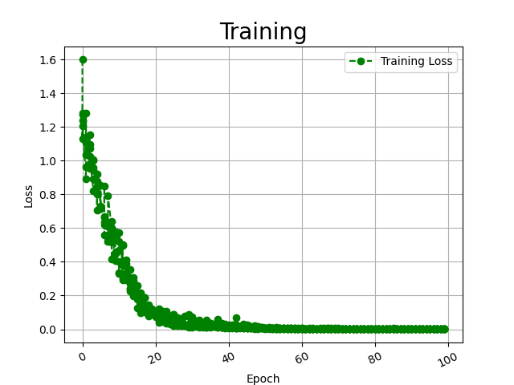
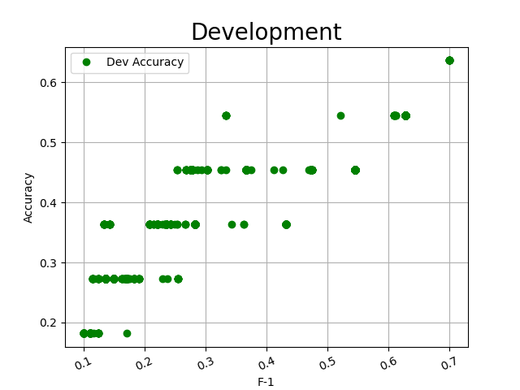

#  **NLP Research**

# **Relation Extraction in Biomedical using Bert-LSTM-CRF model and pytorch**

##  **`Slamet Riyanto S.Kom., M.M.S.I.`**

##  **`Dimas Dwi Putra`**

# [Architecture](https://dimas263.github.io/work/data/RE-Architecture.html)


###  [Notebook 1](BiomedNLP_PubMedBERT_Notebook.ipynb)<br><br>`Created using BiomedNLP-PubMedBERT Pre-Trained Model`<br>

###  [Notebook 2](Biobert_Notebook.ipynb)<br><br>`Created using Biobert Pre-Trained Model`

#  Config

##  BioNLP

```javascript
! python main.py \
--bert_dir=model/BiomedNLP-PubMedBERT/ \
--data_dir=input/data/ \
--log_dir=output/logs/ \
--main_log_dir=output/logs/BiomedNLP-PubMedBERT-main.log \
--preprocess_log_dir=output/logs/BiomedNLP-PubMedBERT-preprocess.log \
--output_dir=output/checkpoint/BiomedNLP-PubMedBERT/ \
--num_tags=4 \
--seed=123 \
--gpu_ids="0" \
--max_seq_len=128 \
--lr=1e-5 \
--other_lr=1e-4 \
--train_batch_size=16 \
--train_epochs=300 \
--eval_batch_size=16 \
--dropout_prob=0.1 \
```

##  Biobert
```yaml
! python main.py \
--bert_dir=model/Biobert/ \
--data_dir=input/data/ \
--log_dir=output/logs/ \
--main_log_dir=output/logs/Biobert-main.log \
--preprocess_log_dir=output/logs/Biobert-preprocess.log \
--output_dir=output/checkpoint/Biobert/ \
--num_tags=4 \
--seed=123 \
--gpu_ids="0" \
--max_seq_len=128 \
--lr=2e-5 \
--other_lr=2e-4 \
--train_batch_size=32 \
--train_epochs=100 \
--eval_batch_size=32 \
--dropout_prob=0.2 \
```

#  Dataset

# [Plant-Disease Corpus](input/data/)


##  Dictionary

```json
{"Cause_of_disease": 0, "Treatment_of_disease": 1, "Negative": 2, "Association": 3}
```
##  Data Preprocessing


##  Example

```yaml
id_relation	<e1start>entity1</e1end>	<e2start>entity2</e2end>	sentence	start_entity1	end_entity1	start_entity2	end_entity2
```
## - Training Set

```yaml
2	The evidence for <e1start> soybean <e1end> products as <e2start> cancer <e2end> preventive agents.  	17	42	55	79
1	[Mortality trends in <e2start> cancer <e2end> attributable to <e1start> tobacco <e1end> in Mexico].  	62	87	21	45
3	<e1start> Areca <e1end> nut chewing has a significant association with <e2start> systemic inflammation <e2end>.	0	23	71	110
...
```
## - Testing Set

```yaml
1	Its effect on <e1start> digitalis <e1end>-caused <e2start> atrial arrhythmias <e2end> is unknown. 	14	41	49	85
0	However, the growth rate of <e2start> tumors <e2end> was not markedly inhibited by <e1start> garlic <e1end>. 	83	107	28	52
1	<e1start> Tobacco <e1end>-related <e2start> cancers <e2end> in Madras, India.  	0	25	34	59
...
```

#  Model input

# [BERT Transformers](model/)

##  BioNLP

```
git clone https://huggingface.co/microsoft/BiomedNLP-PubMedBERT-base-uncased-abstract-fulltext
```

##  Biobert

```
git clone https://huggingface.co/dmis-lab/biobert-v1.1
```


##  Input
```yaml
text : However, more studies need to further explore the roles of vitex agnus castus in fracture repair processes.

2022-06-14 11:58:56,722 - INFO - preprocess.py - convert_bert_example - 96 - text: [CLS] H o w e v e r, [UNK] m o r e [UNK] s t u d i e s [UNK] n e e d [UNK] t o [UNK] f u r t h e r [UNK] e x p l o r e [UNK] t h e [UNK] r o l e s [UNK] o f [UNK] v i t e x [UNK] a g n u s [UNK] c a s t u s [UNK] i n [UNK] f r a c t u r e [UNK] r e p a i r [UNK] p r o c e s s e s. [UNK] [SEP]
2022-06-14 11:58:56,723 - INFO - preprocess.py - convert_bert_example - 97 - token_ids: [101, 145, 184, 192, 174, 191, 174, 187, 117, 100, 182, 184, 187, 174, 100, 188, 189, 190, 173, 178, 174, 188, 100, 183, 174, 174, 173, 100, 189, 184, 100, 175, 190, 187, 189, 177, 174, 187, 100, 174, 193, 185, 181, 184, 187, 174, 100, 189, 177, 174, 100, 187, 184, 181, 174, 188, 100, 184, 175, 100, 191, 178, 189, 174, 193, 100, 170, 176, 183, 190, 188, 100, 172, 170, 188, 189, 190, 188, 100, 178, 183, 100, 175, 187, 170, 172, 189, 190, 187, 174, 100, 187, 174, 185, 170, 178, 187, 100, 185, 187, 184, 172, 174, 188, 188, 174, 188, 119, 100, 102, 0, 0, 0, 0, 0, 0, 0, 0, 0, 0, 0, 0, 0, 0, 0, 0, 0, 0]
2022-06-14 11:58:56,723 - INFO - preprocess.py - convert_bert_example - 98 - attention_masks: [1, 1, 1, 1, 1, 1, 1, 1, 1, 1, 1, 1, 1, 1, 1, 1, 1, 1, 1, 1, 1, 1, 1, 1, 1, 1, 1, 1, 1, 1, 1, 1, 1, 1, 1, 1, 1, 1, 1, 1, 1, 1, 1, 1, 1, 1, 1, 1, 1, 1, 1, 1, 1, 1, 1, 1, 1, 1, 1, 1, 1, 1, 1, 1, 1, 1, 1, 1, 1, 1, 1, 1, 1, 1, 1, 1, 1, 1, 1, 1, 1, 1, 1, 1, 1, 1, 1, 1, 1, 1, 1, 1, 1, 1, 1, 1, 1, 1, 1, 1, 1, 1, 1, 1, 1, 1, 1, 1, 1, 1, 0, 0, 0, 0, 0, 0, 0, 0, 0, 0, 0, 0, 0, 0, 0, 0, 0, 0]
2022-06-14 11:58:56,723 - INFO - preprocess.py - convert_bert_example - 99 - token_type_ids: [0, 0, 0, 0, 0, 0, 0, 0, 0, 0, 0, 0, 0, 0, 0, 0, 0, 0, 0, 0, 0, 0, 0, 0, 0, 0, 0, 0, 0, 0, 0, 0, 0, 0, 0, 0, 0, 0, 0, 0, 0, 0, 0, 0, 0, 0, 0, 0, 0, 0, 0, 0, 0, 0, 0, 0, 0, 0, 0, 0, 0, 0, 0, 0, 0, 0, 0, 0, 0, 0, 0, 0, 0, 0, 0, 0, 0, 0, 0, 0, 0, 0, 0, 0, 0, 0, 0, 0, 0, 0, 0, 0, 0, 0, 0, 0, 0, 0, 0, 0, 0, 0, 0, 0, 0, 0, 0, 0, 0, 0, 0, 0, 0, 0, 0, 0, 0, 0, 0, 0, 0, 0, 0, 0, 0, 0, 0, 0]
2022-06-14 11:58:56,723 - INFO - preprocess.py - convert_bert_example - 100 - labels: 0
2022-06-14 11:58:56,724 - INFO - preprocess.py - convert_bert_example - 101 - ids: [60, 78, 82, 90]

. . . 
```
[LOAD MORE..](output/logs)

#  Output

## Visualization

##  BioNLP


##  Biobert



[LOAD MORE.. ](output/visualization)

## Train, Test, Predict

| Model Input                                     | Biobert                         | BiomedNLP-PubMedBERT                   |
|-------------------------------------------------|---------------------------------|----------------------------------------|
| Learning Rate                                   | 0,00002                         | 0,00001                                |
| Other Learning Rate                             | 0,0002                          | 0,0001                                 |
| Batch Size                                      | 32                              | 16                                     |
| Total Epoch                                     | 100                             | 300                                    |
| Iterasi                                         | 6                               | 12                                     |
| Total Steps                                     | 600                             | 3600                                   |
| Dropout                                         | 0,2                             | 0,1                                    |
| Epoch Ke -                                      | 24                              | 226                                    |
| Step Ke -                                       | 145                             | 2723                                   |
| Train Loss                                      | 0,047816                        | 0,000336                               |
| Dev Loss                                        | 1,50633                         | 3,593393                               |
| Accuracy                                        | 0,7872                          | 0,7872                                 |
| Micro F-1                                       | 0,7872                          | 0,7872                                 |
| Macro F-1                                       | 0,8393                          | 0,8361                                 |
| ----------------------------------------------- | ------------------------------- | -------------------------------------- |
| Precision `Cause Of Disease`                    | 0,9                             | 0,69                                   |
| Precision `Treatment Of Disease`                | 0,88                            | 0,79                                   |
| Precision `Negative`                            | 0,63                            | 0,91                                   |
| Precision `Association`                         | 1,00                            | 1,00                                   |
| Precision `Macro Average`                       | 0,85                            | 0,85                                   |
| Precision `Weighted Average`                    | 0,81                            | 0,81                                   |
| ----------------------------------------------- | ------------------------------- | -------------------------------------- |
| Recall `Cause Of Disease`                       | 0,75                            | 0,92                                   |
| Recall `Treatment Of Disease`                   | 0,79                            | 0,79                                   |
| Recall `Negative`                               | 0,80                            | 0,67                                   |
| Recall `Association`                            | 1,00                            | 1,00                                   |
| Recall `Macro Average`                          | 0,83                            | 0,84                                   |
| Recall `Weighted Average`                       | 0,79                            | 0,79                                   |
| ----------------------------------------------- | ------------------------------- | -------------------------------------- |
| F-1 `Cause Of Disease`                          | 0,82                            | 0,79                                   |
| F-1 `Treatment Of Disease`                      | 0,83                            | 0,79                                   |
| F-1 `Negative`                                  | 0,71                            | 0,77                                   |
| F-1 `Association`                               | 1,00                            | 1,00                                   |
| F-1 `Accuracy`                                  | 0,79                            | 0,79                                   |
| F-1 `Macro Average`                             | 0,84                            | 0,84                                   |
| F-1 `Weighted Average`                          | 0,79                            | 0,79                                   |
| Execution Time (x minutes y second)             | 10 m 51 s                       | 41 m 7 s                               |
| Processor                                       | Tesla P100-PCIE-16GB            | Tesla P100-PCIE-16GB                   |

# Prediksi

```javascript
A lipid-soluble red ginseng extract inhibits the growth of human lung tumor xenografts in nude mice.
torch.Size([1, 4, 768])
predict labels：Treatment_of_disease
true label：Treatment_of_disease

Our data also suggest that bleomycin sensitivity may modulate the effect of tobacco smoking on breast cancer risk.
torch.Size([1, 4, 768])
predict labels：Treatment_of_disease
true label：Cause_of_disease

Mutagen sensitivity, tobacco smoking and breast cancer risk: a case-control study.
torch.Size([1, 4, 768])
predict labels：Treatment_of_disease
true label：Negative

Animals given AFB1 together with fresh garlic or garlic oil showed a significant reduction in tumor incidence.
torch.Size([1, 4, 768])
predict labels：Cause_of_disease
true label：Treatment_of_disease

Animals given AFB1 together with fresh garlic or garlic oil showed a significant reduction in tumor incidence.
torch.Size([1, 4, 768])
predict labels：Cause_of_disease
true label：Treatment_of_disease

Mutagen sensitivity, tobacco smoking and breast cancer risk: a case-control study.
torch.Size([1, 4, 768])
predict labels：Treatment_of_disease
true label：Negative
```

#  Model output

```yaml
- 1.3G Jun 27 13:17 Biobert/best.pt
- 1.3G Jun 27 14:17 BiomedNLP-PubMedBERT/best.pt
```

